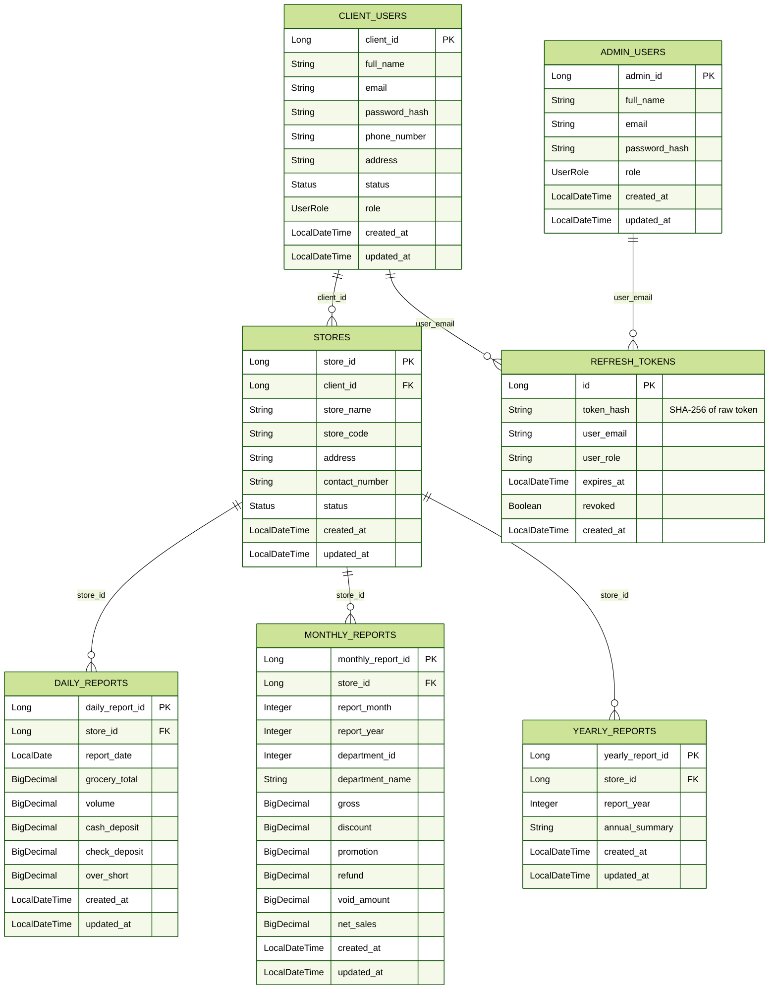

# Software Requirements Specification — Hands Of Retail Backend API

**Version:** 1.1  
**Date:** 2026-06-04  
**Base URL:** `http://localhost:8080`  
**Content-Type:** `application/json` (unless noted otherwise)  
**Auth Scheme:** HttpOnly Cookies (`access_token` + `refresh_token`)

---

## Table of Contents

1. [Introduction](#1-introduction)
2. [System Architecture](#2-system-architecture)
3. [Authentication & Authorization](#3-authentication--authorization)
4. [Common Response Envelope](#4-common-response-envelope)
5. [Error Handling Reference](#5-error-handling-reference)
6. [Database Schema](#6-database-schema)
7. [Endpoint Specifications](#7-endpoint-specifications)
   - [7.1 Auth APIs](#71-auth-apis)
   - [7.2 Admin — Client Management](#72-admin--client-management)
   - [7.3 Admin — Store Management](#73-admin--store-management)
   - [7.4 Admin — Daily Reports](#74-admin--daily-reports)
   - [7.5 Admin — Monthly Reports](#75-admin--monthly-reports)
   - [7.6 Admin — Yearly Reports](#76-admin--yearly-reports)
   - [7.7 Client — Store Access](#77-client--store-access)
   - [7.8 Client — Daily Reports](#78-client--daily-reports)
   - [7.9 Client — Monthly Reports](#79-client--monthly-reports)
   - [7.10 Client — Yearly Reports](#710-client--yearly-reports)
8. [Non-Functional Requirements](#8-non-functional-requirements)
9. [Business Rules](#9-business-rules)

---

## 1. Introduction

### 1.1 Project Overview

**Hands Of Retail** is a Spring Boot 3.4.x REST API that manages retail **clients**, **stores**, and **sales reports** (daily, monthly, yearly). It provides cookie-based JWT-authenticated APIs for two roles:

- **ADMIN** — full CRUD over all resources
- **CLIENT** — read-only access to their own stores and reports

### 1.2 Technology Stack

| Layer            | Technology                             |
|------------------|----------------------------------------|
| Runtime          | Java 21                                |
| Framework        | Spring Boot 3.4.x                      |
| Security         | Spring Security + JWT (HttpOnly Cookies) |
| Persistence      | Spring Data JPA                        |
| Default Database | H2 (file-based, `./database/h2/retail-db`) |
| Alt Database     | PostgreSQL (via config)                |
| Schema Migrations| Flyway                                 |
| API Docs         | Swagger / OpenAPI (auto-generated)     |

### 1.3 Scope

The backend covers:
- Authentication (login / access+refresh token issuance via HttpOnly cookies / token rotation / logout)
- Client management (CRUD)
- Store management (CRUD + status toggle)
- Daily reporting (CRUD + filtering)
- Monthly reporting (CRUD + bulk Excel upload + filtering)
- Yearly reporting (CRUD + filtering)

---

## 2. System Architecture

```
Browser / Postman
      │  Requests carry HttpOnly cookies automatically (no manual headers)
      │    access_token  (JWT, Path=/, 15 min)
      │    refresh_token (opaque, Path=/api/v1/auth, 7 days)
      ▼
Spring Security Filter Chain
      │  JwtAuthenticationFilter → reads access_token cookie,
      │                             validates JWT, sets SecurityContext
      ▼
REST Controllers  (/api/v1/...)
      │
Service Layer (business logic + ownership checks)
      │
Repository Layer (Spring Data JPA)
      │
H2 / PostgreSQL Database
      │  refresh_tokens table (SHA-256 hashed, revocable)
```

### Route Security Matrix

| Path Pattern              | Permitted Roles     |
|---------------------------|---------------------|
| `/api/v1/auth/**`         | Anonymous (public)  |
| `/api/v1/admin/**`        | `ADMIN` only        |
| `/api/v1/client/**`       | `CLIENT` only       |
| `/swagger-ui/**`          | Anonymous (public)  |
| `/v3/api-docs/**`         | Anonymous (public)  |
| `/h2-console/**`          | Anonymous (dev only)|
| Any other path            | Authenticated       |

---

## 3. Authentication & Authorization

### Token Strategy

The API uses a **dual-token HttpOnly cookie** scheme. No `Authorization` header is required — the browser / client attaches cookies automatically.

| Cookie | Type | Lifetime | Path | Flags |
|---|---|---|---|---|
| `access_token` | JWT (signed HS256) | **15 minutes** | `/` | `HttpOnly; SameSite=Strict` |
| `refresh_token` | Opaque random string | **7 days** | `/api/v1/auth` | `HttpOnly; SameSite=Strict` |

- The **access token** is a short-lived JWT encoding the user's `email` and `role`. It is validated by `JwtAuthenticationFilter` on every request.
- The **refresh token** is stored as a SHA-256 hash in the `refresh_tokens` database table. It is used **only** to issue a new access token via `POST /api/v1/auth/refresh`.
- **Refresh Token Rotation** — every call to `/refresh` revokes the old refresh token and issues a brand-new one.
- On `logout`, both tokens are revoked and both cookies are cleared (MaxAge=0).

> **JavaScript cannot read these cookies** because they are `HttpOnly`. This protects against XSS token theft.

### Secure Flag

| Environment | `Secure` flag |
|---|---|
| Local dev (HTTP) | `false` |
| Production (HTTPS) | `true` — set via `JWT_REFRESH_COOKIE_SECURE=true` |

---

## 4. Common Response Envelope

Every API response (success **and** error) is wrapped in the following JSON envelope:

```json
{
  "success": true | false,
  "message": "Human-readable status message",
  "data": { ... } | [ ... ] | null,
  "errors": { "fieldName": "error message" } | null,
  "timestamp": "2026-06-03T18:20:00.000Z"
}
```

| Field       | Type              | Always Present | Description                                      |
|-------------|-------------------|----------------|--------------------------------------------------|
| `success`   | `boolean`         | ✅              | `true` on success, `false` on error              |
| `message`   | `string`          | ✅              | Human-readable outcome description               |
| `data`      | `object` / `array`| ❌ (omitted if null) | Payload on success; null/omitted on error   |
| `errors`    | `object`          | ❌ (omitted if null) | Field-level validation errors map            |
| `timestamp` | `ISO-8601 string` | ✅              | Server time when response was generated          |

---

## 5. Error Handling Reference

All error responses follow the common envelope with `"success": false`.

### 5.1 HTTP Status Codes

| HTTP Status | When Triggered                                              | Exception Class               |
|-------------|-------------------------------------------------------------|-------------------------------|
| `400`       | Validation failure on request body fields                   | `MethodArgumentNotValidException` |
| `400`       | General bad request (business logic rejection)              | `BadRequestException`         |
| `401`       | Missing or invalid JWT token                                | `UnauthorizedException`       |
| `403`       | Valid token but insufficient role/ownership                 | `ForbiddenException`          |
| `404`       | Referenced resource does not exist                          | `ResourceNotFoundException`   |
| `409`       | Duplicate resource (e.g., email or store code already used) | `DuplicateResourceException`  |
| `500`       | Unexpected internal server error                            | `Exception` (fallback)        |

### 5.2 Error Response Bodies

**400 — Validation Error (field-level)**
```json
{
  "success": false,
  "message": "Validation failed",
  "errors": {
    "email": "must be a well-formed email address",
    "password": "must not be blank"
  },
  "timestamp": "2026-06-03T18:20:00.000Z"
}
```

**400 — Bad Request (business logic)**
```json
{
  "success": false,
  "message": "Store not found for the given client",
  "timestamp": "2026-06-03T18:20:00.000Z"
}
```

**401 — Unauthorized**
```json
{
  "success": false,
  "message": "Authentication required",
  "timestamp": "2026-06-03T18:20:00.000Z"
}
```

**403 — Forbidden**
```json
{
  "success": false,
  "message": "Access denied",
  "timestamp": "2026-06-03T18:20:00.000Z"
}
```

**404 — Not Found**
```json
{
  "success": false,
  "message": "Client not found with id: 99",
  "timestamp": "2026-06-03T18:20:00.000Z"
}
```

**409 — Conflict / Duplicate**
```json
{
  "success": false,
  "message": "Email already in use: john@gmail.com",
  "timestamp": "2026-06-03T18:20:00.000Z"
}
```

**500 — Internal Server Error**
```json
{
  "success": false,
  "message": "Unexpected error",
  "timestamp": "2026-06-03T18:20:00.000Z"
}
```

---

## 6. Database Schema



### Enumerations

| Enum       | Values              |
|------------|---------------------|
| `UserRole` | `ADMIN`, `CLIENT`   |
| `Status`   | `ACTIVE`, `INACTIVE`|

---

## 7. Endpoint Specifications

---

### 7.1 Auth APIs

---

#### `POST /api/v1/auth/login`

**Purpose:** Authenticate a user (admin or client). Issues both tokens as HttpOnly cookies — no token in the response body.  
**Auth Required:** ❌ None  
**HTTP Status (success):** `200 OK`

##### Request Body

| Field      | Type     | Required | Validation              |
|------------|----------|----------|-------------------------|
| `email`    | `string` | ✅        | Must be a valid email   |
| `password` | `string` | ✅        | Must not be blank       |

```json
{
  "email": "admin@gmail.com",
  "password": "password123"
}
```

##### Success Response — `200 OK`

```json
{
  "success": true,
  "message": "Login successful",
  "data": {
    "role": "ADMIN",
    "email": "admin@gmail.com",
    "fullName": "Admin User"
  },
  "timestamp": "2026-06-03T18:20:00.000Z"
}
```

##### Response Cookies (Set-Cookie headers)

| Cookie | Content | Path | MaxAge | Flags |
|---|---|---|---|---|
| `access_token` | Signed JWT | `/` | 900 s (15 min) | `HttpOnly` |
| `refresh_token` | Opaque random string | `/api/v1/auth` | 604800 s (7 days) | `HttpOnly` |

##### Response — `data` Object Fields

| Field      | Type     | Description                         |
|------------|----------|-------------------------------------|
| `role`     | `string` | `ADMIN` or `CLIENT`                 |
| `email`    | `string` | Authenticated user's email          |
| `fullName` | `string` | Authenticated user's full name      |

##### Error Responses

| Status | Scenario                         | Example `message`              |
|--------|----------------------------------|--------------------------------|
| `400`  | Blank or invalid email format    | `"Validation failed"`          |
| `400`  | Blank password                   | `"Validation failed"`          |
| `401`  | Wrong credentials                | `"Invalid email or password"`  |

**Validation Error Example (400):**
```json
{
  "success": false,
  "message": "Validation failed",
  "errors": {
    "email": "must be a well-formed email address",
    "password": "must not be blank"
  },
  "timestamp": "2026-06-03T18:20:00.000Z"
}
```

**Unauthorized Error Example (401):**
```json
{
  "success": false,
  "message": "Invalid email or password",
  "timestamp": "2026-06-03T18:20:00.000Z"
}
```

---

#### `POST /api/v1/auth/refresh`

**Purpose:** Exchange a valid `refresh_token` cookie for a new `access_token` cookie. Implements **refresh token rotation** — the old refresh token is revoked and a new one is issued.  
**Auth Required:** ❌ None (authenticated via `refresh_token` cookie)  
**HTTP Status (success):** `200 OK`

##### Request

No request body. The `refresh_token` cookie is sent automatically by the browser.

##### Success Response — `200 OK`

```json
{
  "success": true,
  "message": "Token refreshed",
  "data": {
    "role": "ADMIN",
    "email": "admin@gmail.com"
  },
  "timestamp": "2026-06-03T18:20:00.000Z"
}
```

A fresh `access_token` cookie (15 min) and rotated `refresh_token` cookie (7 days) are set in the response headers.

##### Error Responses

| Status | Scenario                                      | Example `message`                     |
|--------|-----------------------------------------------|---------------------------------------|
| `401`  | `refresh_token` cookie missing                | `"Refresh token cookie is missing"`   |
| `401`  | Token not found in DB / already rotated       | `"Invalid refresh token"`             |
| `401`  | Token revoked                                 | `"Refresh token has been revoked"`    |
| `401`  | Token expired (> 7 days)                      | `"Refresh token has expired"`         |

---

#### `POST /api/v1/auth/logout`

**Purpose:** Revoke the refresh token in the database and clear both HttpOnly cookies.  
**Auth Required:** ❌ None (authenticated via `refresh_token` cookie)  
**HTTP Status (success):** `200 OK`

##### Request

No request body. The `refresh_token` cookie is sent automatically by the browser.

##### Success Response — `200 OK`

```json
{
  "success": true,
  "message": "Logged out successfully",
  "data": null,
  "timestamp": "2026-06-03T18:20:00.000Z"
}
```

Both `access_token` and `refresh_token` cookies are cleared (`MaxAge=0`).

##### Error Responses

| Status | Scenario                          | Example `message`                   |
|--------|-----------------------------------|-------------------------------------|
| `401`  | `refresh_token` cookie missing    | `"Refresh token cookie is missing"` |
| `401`  | Token invalid / already revoked   | `"Invalid refresh token"`           |

---

### 7.2 Admin — Client Management

> All endpoints under `/api/v1/admin/**` require a valid `access_token` cookie with role `ADMIN`. The cookie is attached automatically by the browser on every request.

---

#### `POST /api/v1/admin/clients`

**Purpose:** Create a new client user account.  
**Auth Required:** ✅ ADMIN  
**HTTP Status (success):** `201 Created`

##### Request Body

| Field         | Type     | Required | Validation             |
|---------------|----------|----------|------------------------|
| `fullName`    | `string` | ✅        | Must not be blank      |
| `email`       | `string` | ✅        | Must be a valid email; must be unique |
| `password`    | `string` | ✅        | Must not be blank      |
| `phoneNumber` | `string` | ❌        | Optional               |
| `address`     | `string` | ❌        | Optional               |

```json
{
  "fullName": "John Doe",
  "email": "john@gmail.com",
  "password": "password123",
  "phoneNumber": "9876543210",
  "address": "New York"
}
```

##### Success Response — `201 Created`

```json
{
  "success": true,
  "message": "Client created",
  "data": {
    "clientId": 1,
    "fullName": "John Doe",
    "email": "john@gmail.com",
    "phoneNumber": "9876543210",
    "address": "New York",
    "status": "ACTIVE",
    "role": "CLIENT"
  },
  "timestamp": "2026-06-03T18:20:00.000Z"
}
```

##### Response — `data` Object Fields

| Field         | Type     | Description                        |
|---------------|----------|------------------------------------|
| `clientId`    | `Long`   | Auto-generated primary key         |
| `fullName`    | `string` | Client's full name                 |
| `email`       | `string` | Client's email address             |
| `phoneNumber` | `string` | Client's phone number (nullable)   |
| `address`     | `string` | Client's address (nullable)        |
| `status`      | `string` | `ACTIVE` (default on creation)     |
| `role`        | `string` | Always `CLIENT`                    |

##### Error Responses

| Status | Scenario                         | Example `message`                        |
|--------|----------------------------------|------------------------------------------|
| `400`  | Blank `fullName`, invalid email, blank `password` | `"Validation failed"` |
| `401`  | Missing or invalid JWT           | `"Authentication required"`              |
| `403`  | Authenticated but not ADMIN      | `"Access denied"`                        |
| `409`  | Email already in use             | `"Email already in use: john@gmail.com"` |

**Validation Error (400):**
```json
{
  "success": false,
  "message": "Validation failed",
  "errors": {
    "fullName": "must not be blank",
    "email": "must be a well-formed email address"
  },
  "timestamp": "2026-06-03T18:20:00.000Z"
}
```

**Conflict Error (409):**
```json
{
  "success": false,
  "message": "Email already in use: john@gmail.com",
  "timestamp": "2026-06-03T18:20:00.000Z"
}
```

---

#### `GET /api/v1/admin/clients`

**Purpose:** Retrieve all registered client accounts.  
**Auth Required:** ✅ ADMIN  
**HTTP Status (success):** `200 OK`

##### Query Parameters

None.

##### Success Response — `200 OK`

```json
{
  "success": true,
  "message": "Clients fetched",
  "data": [
    {
      "clientId": 1,
      "fullName": "John Doe",
      "email": "john@gmail.com",
      "phoneNumber": "9876543210",
      "address": "New York",
      "status": "ACTIVE",
      "role": "CLIENT"
    },
    {
      "clientId": 2,
      "fullName": "Jane Smith",
      "email": "jane@gmail.com",
      "phoneNumber": "9123456789",
      "address": "Los Angeles",
      "status": "INACTIVE",
      "role": "CLIENT"
    }
  ],
  "timestamp": "2026-06-03T18:20:00.000Z"
}
```

##### Error Responses

| Status | Scenario                    | Example `message`          |
|--------|-----------------------------|----------------------------|
| `401`  | Missing / invalid JWT       | `"Authentication required"` |
| `403`  | Not an ADMIN                | `"Access denied"`           |

---

#### `PUT /api/v1/admin/clients/{id}`

**Purpose:** Update an existing client's details.  
**Auth Required:** ✅ ADMIN  
**HTTP Status (success):** `200 OK`

##### Path Variable

| Name | Type   | Description             |
|------|--------|-------------------------|
| `id` | `Long` | Client's primary key ID |

##### Request Body

All fields are **optional** (partial update). Only provided fields are applied.

| Field         | Type     | Required | Validation              |
|---------------|----------|----------|-------------------------|
| `fullName`    | `string` | ❌        | Optional                |
| `email`       | `string` | ❌        | Must be valid email if provided; must be unique |
| `password`    | `string` | ❌        | If provided, will be hashed and stored |
| `phoneNumber` | `string` | ❌        | Optional                |
| `address`     | `string` | ❌        | Optional                |

```json
{
  "fullName": "John Updated",
  "email": "johnupdated@gmail.com",
  "password": "newpassword456",
  "phoneNumber": "9999999999",
  "address": "Chicago"
}
```

##### Success Response — `200 OK`

```json
{
  "success": true,
  "message": "Client updated",
  "data": {
    "clientId": 1,
    "fullName": "John Updated",
    "email": "johnupdated@gmail.com",
    "phoneNumber": "9999999999",
    "address": "Chicago",
    "status": "ACTIVE",
    "role": "CLIENT"
  },
  "timestamp": "2026-06-03T18:20:00.000Z"
}
```

##### Error Responses

| Status | Scenario                       | Example `message`                         |
|--------|--------------------------------|-------------------------------------------|
| `400`  | Invalid email format in body   | `"Validation failed"`                     |
| `401`  | Missing / invalid JWT          | `"Authentication required"`               |
| `403`  | Not an ADMIN                   | `"Access denied"`                         |
| `404`  | Client ID does not exist       | `"Client not found with id: 99"`          |
| `409`  | New email already in use       | `"Email already in use: other@gmail.com"` |

---

### 7.3 Admin — Store Management

---

#### `POST /api/v1/admin/stores`

**Purpose:** Create a new store linked to an existing client.  
**Auth Required:** ✅ ADMIN  
**HTTP Status (success):** `201 Created`

##### Request Body

| Field           | Type     | Required | Validation                        |
|-----------------|----------|----------|-----------------------------------|
| `clientId`      | `Long`   | ✅        | Must not be null; client must exist |
| `storeName`     | `string` | ✅        | Must not be blank                 |
| `storeCode`     | `string` | ✅        | Must not be blank; must be unique |
| `address`       | `string` | ❌        | Optional                          |
| `contactNumber` | `string` | ❌        | Optional                          |

```json
{
  "clientId": 1,
  "storeName": "Walmart Downtown",
  "storeCode": "WM001",
  "address": "California",
  "contactNumber": "9876543210"
}
```

##### Success Response — `201 Created`

```json
{
  "success": true,
  "message": "Store created",
  "data": {
    "storeId": 1,
    "clientId": 1,
    "clientName": "John Doe",
    "storeName": "Walmart Downtown",
    "storeCode": "WM001",
    "address": "California",
    "contactNumber": "9876543210",
    "status": "ACTIVE"
  },
  "timestamp": "2026-06-03T18:20:00.000Z"
}
```

##### Response — `data` Object Fields

| Field           | Type     | Description                           |
|-----------------|----------|---------------------------------------|
| `storeId`       | `Long`   | Auto-generated store ID               |
| `clientId`      | `Long`   | ID of the owning client               |
| `clientName`    | `string` | Full name of the owning client        |
| `storeName`     | `string` | Store name                            |
| `storeCode`     | `string` | Unique store code                     |
| `address`       | `string` | Store address (nullable)              |
| `contactNumber` | `string` | Contact number (nullable)             |
| `status`        | `string` | `ACTIVE` (default on creation)        |

##### Error Responses

| Status | Scenario                            | Example `message`                        |
|--------|-------------------------------------|------------------------------------------|
| `400`  | Blank `storeName` or `storeCode`, null `clientId` | `"Validation failed"`     |
| `401`  | Missing / invalid JWT               | `"Authentication required"`              |
| `403`  | Not an ADMIN                        | `"Access denied"`                        |
| `404`  | `clientId` not found                | `"Client not found with id: 99"`         |
| `409`  | `storeCode` already exists          | `"Store code already in use: WM001"`     |

---

#### `GET /api/v1/admin/stores`

**Purpose:** Retrieve all stores, optionally filtered by client and/or status.  
**Auth Required:** ✅ ADMIN  
**HTTP Status (success):** `200 OK`

##### Query Parameters

| Param      | Type     | Required | Description                              |
|------------|----------|----------|------------------------------------------|
| `clientId` | `Long`   | ❌        | Filter stores by client ID               |
| `status`   | `string` | ❌        | Filter by status: `ACTIVE` or `INACTIVE` |

**Example request:**
```
GET /api/v1/admin/stores?clientId=1&status=ACTIVE
```

##### Success Response — `200 OK`

```json
{
  "success": true,
  "message": "Stores fetched",
  "data": [
    {
      "storeId": 1,
      "clientId": 1,
      "clientName": "John Doe",
      "storeName": "Walmart Downtown",
      "storeCode": "WM001",
      "address": "California",
      "contactNumber": "9876543210",
      "status": "ACTIVE"
    }
  ],
  "timestamp": "2026-06-03T18:20:00.000Z"
}
```

##### Error Responses

| Status | Scenario              | Example `message`           |
|--------|-----------------------|-----------------------------|
| `401`  | Missing / invalid JWT | `"Authentication required"` |
| `403`  | Not an ADMIN          | `"Access denied"`           |

---

#### `GET /api/v1/admin/stores/{storeId}`

**Purpose:** Retrieve details of a single store by its ID.  
**Auth Required:** ✅ ADMIN  
**HTTP Status (success):** `200 OK`

##### Path Variable

| Name      | Type   | Description     |
|-----------|--------|-----------------|
| `storeId` | `Long` | Store's primary key |

##### Success Response — `200 OK`

```json
{
  "success": true,
  "message": "Store fetched",
  "data": {
    "storeId": 1,
    "clientId": 1,
    "clientName": "John Doe",
    "storeName": "Walmart Downtown",
    "storeCode": "WM001",
    "address": "California",
    "contactNumber": "9876543210",
    "status": "ACTIVE"
  },
  "timestamp": "2026-06-03T18:20:00.000Z"
}
```

##### Error Responses

| Status | Scenario              | Example `message`                    |
|--------|-----------------------|--------------------------------------|
| `401`  | Missing / invalid JWT | `"Authentication required"`          |
| `403`  | Not an ADMIN          | `"Access denied"`                    |
| `404`  | Store ID not found    | `"Store not found with id: 99"`      |

---

#### `PUT /api/v1/admin/stores/{storeId}`

**Purpose:** Update an existing store's details. All fields are optional (partial update).  
**Auth Required:** ✅ ADMIN  
**HTTP Status (success):** `200 OK`

##### Path Variable

| Name      | Type   | Description     |
|-----------|--------|-----------------|
| `storeId` | `Long` | Store's primary key |

##### Request Body

| Field           | Type     | Required | Validation                              |
|-----------------|----------|----------|-----------------------------------------|
| `clientId`      | `Long`   | ❌        | If provided, re-assigns store to client |
| `storeName`     | `string` | ❌        | Optional                                |
| `storeCode`     | `string` | ❌        | Must be unique if provided              |
| `address`       | `string` | ❌        | Optional                                |
| `contactNumber` | `string` | ❌        | Optional                                |

```json
{
  "clientId": 1,
  "storeName": "Walmart Uptown",
  "storeCode": "WM002",
  "address": "Nevada",
  "contactNumber": "9111111111"
}
```

##### Success Response — `200 OK`

```json
{
  "success": true,
  "message": "Store updated",
  "data": {
    "storeId": 1,
    "clientId": 1,
    "clientName": "John Doe",
    "storeName": "Walmart Uptown",
    "storeCode": "WM002",
    "address": "Nevada",
    "contactNumber": "9111111111",
    "status": "ACTIVE"
  },
  "timestamp": "2026-06-03T18:20:00.000Z"
}
```

##### Error Responses

| Status | Scenario                   | Example `message`                    |
|--------|----------------------------|--------------------------------------|
| `401`  | Missing / invalid JWT      | `"Authentication required"`          |
| `403`  | Not an ADMIN               | `"Access denied"`                    |
| `404`  | Store ID not found         | `"Store not found with id: 99"`      |
| `404`  | Provided `clientId` not found | `"Client not found with id: 99"`  |
| `409`  | New `storeCode` already in use | `"Store code already in use: WM002"` |

---

#### `PATCH /api/v1/admin/stores/{storeId}/status`

**Purpose:** Activate or deactivate a store independently of other fields.  
**Auth Required:** ✅ ADMIN  
**HTTP Status (success):** `200 OK`

##### Path Variable

| Name      | Type   | Description         |
|-----------|--------|---------------------|
| `storeId` | `Long` | Store's primary key |

##### Query Parameter

| Param    | Type     | Required | Values                |
|----------|----------|----------|-----------------------|
| `status` | `string` | ✅        | `ACTIVE` or `INACTIVE` |

**Example request:**
```
PATCH /api/v1/admin/stores/1/status?status=INACTIVE
```

##### Success Response — `200 OK`

```json
{
  "success": true,
  "message": "Store status updated",
  "data": {
    "storeId": 1,
    "clientId": 1,
    "clientName": "John Doe",
    "storeName": "Walmart Downtown",
    "storeCode": "WM001",
    "address": "California",
    "contactNumber": "9876543210",
    "status": "INACTIVE"
  },
  "timestamp": "2026-06-03T18:20:00.000Z"
}
```

##### Error Responses

| Status | Scenario               | Example `message`                    |
|--------|------------------------|--------------------------------------|
| `400`  | Invalid `status` value | `"Invalid status value"`             |
| `401`  | Missing / invalid JWT  | `"Authentication required"`          |
| `403`  | Not an ADMIN           | `"Access denied"`                    |
| `404`  | Store ID not found     | `"Store not found with id: 99"`      |

---

### 7.4 Admin — Daily Reports

---

#### `POST /api/v1/admin/daily-reports`

**Purpose:** Create a new daily report for a store.  
**Auth Required:** ✅ ADMIN  
**HTTP Status (success):** `201 Created`

##### Request Body

| Field          | Type         | Required | Validation                   |
|----------------|--------------|----------|------------------------------|
| `storeId`      | `Long`       | ✅        | Must not be null; store must exist |
| `reportDate`   | `string`     | ✅        | ISO date format: `YYYY-MM-DD` |
| `groceryTotal` | `number`     | ❌        | Decimal (BigDecimal), optional |
| `volume`       | `number`     | ❌        | Decimal, optional            |
| `cashDeposit`  | `number`     | ❌        | Decimal, optional            |
| `checkDeposit` | `number`     | ❌        | Decimal, optional            |
| `overShort`    | `number`     | ❌        | Decimal (can be negative), optional |

```json
{
  "storeId": 1,
  "reportDate": "2026-05-28",
  "groceryTotal": 10000.00,
  "volume": 200.00,
  "cashDeposit": 5000.00,
  "checkDeposit": 2000.00,
  "overShort": 100.00
}
```

##### Success Response — `201 Created`

```json
{
  "success": true,
  "message": "Daily report created",
  "data": {
    "dailyReportId": 1,
    "storeId": 1,
    "storeName": "Walmart Downtown",
    "reportDate": "2026-05-28",
    "groceryTotal": 10000.00,
    "volume": 200.00,
    "cashDeposit": 5000.00,
    "checkDeposit": 2000.00,
    "overShort": 100.00
  },
  "timestamp": "2026-06-03T18:20:00.000Z"
}
```

##### Response — `data` Object Fields

| Field           | Type         | Description                      |
|-----------------|--------------|----------------------------------|
| `dailyReportId` | `Long`       | Auto-generated report ID         |
| `storeId`       | `Long`       | ID of the associated store       |
| `storeName`     | `string`     | Name of the associated store     |
| `reportDate`    | `string`     | Report date (`YYYY-MM-DD`)       |
| `groceryTotal`  | `BigDecimal` | Total grocery sales              |
| `volume`        | `BigDecimal` | Volume figure                    |
| `cashDeposit`   | `BigDecimal` | Cash deposit amount              |
| `checkDeposit`  | `BigDecimal` | Check deposit amount             |
| `overShort`     | `BigDecimal` | Over/short amount (can be negative) |

##### Error Responses

| Status | Scenario                     | Example `message`                |
|--------|------------------------------|----------------------------------|
| `400`  | Null `storeId` or `reportDate` | `"Validation failed"`          |
| `401`  | Missing / invalid JWT        | `"Authentication required"`      |
| `403`  | Not an ADMIN                 | `"Access denied"`                |
| `404`  | `storeId` not found          | `"Store not found with id: 99"`  |

---

#### `GET /api/v1/admin/daily-reports`

**Purpose:** Retrieve daily reports with optional filters.  
**Auth Required:** ✅ ADMIN  
**HTTP Status (success):** `200 OK`

##### Query Parameters

| Param      | Type         | Required | Description                            |
|------------|--------------|----------|----------------------------------------|
| `storeId`  | `Long`       | ❌        | Filter by store ID                     |
| `clientId` | `Long`       | ❌        | Filter by client ID (all their stores) |
| `from`     | `string`     | ❌        | Date range start — `YYYY-MM-DD`        |
| `to`       | `string`     | ❌        | Date range end — `YYYY-MM-DD`          |

**Example request:**
```
GET /api/v1/admin/daily-reports?storeId=1&from=2026-05-01&to=2026-05-31
```

##### Success Response — `200 OK`

```json
{
  "success": true,
  "message": "Daily reports fetched",
  "data": [
    {
      "dailyReportId": 1,
      "storeId": 1,
      "storeName": "Walmart Downtown",
      "reportDate": "2026-05-28",
      "groceryTotal": 10000.00,
      "volume": 200.00,
      "cashDeposit": 5000.00,
      "checkDeposit": 2000.00,
      "overShort": 100.00
    }
  ],
  "timestamp": "2026-06-03T18:20:00.000Z"
}
```

##### Error Responses

| Status | Scenario              | Example `message`           |
|--------|-----------------------|-----------------------------|
| `401`  | Missing / invalid JWT | `"Authentication required"` |
| `403`  | Not an ADMIN          | `"Access denied"`           |

---

#### `GET /api/v1/admin/daily-reports/store/{storeId}`

**Purpose:** Retrieve all daily reports for a specific store.  
**Auth Required:** ✅ ADMIN  
**HTTP Status (success):** `200 OK`

##### Path Variable

| Name      | Type   | Description         |
|-----------|--------|---------------------|
| `storeId` | `Long` | Store's primary key |

##### Success Response — `200 OK`

```json
{
  "success": true,
  "message": "Daily reports fetched",
  "data": [
    {
      "dailyReportId": 1,
      "storeId": 1,
      "storeName": "Walmart Downtown",
      "reportDate": "2026-05-28",
      "groceryTotal": 10000.00,
      "volume": 200.00,
      "cashDeposit": 5000.00,
      "checkDeposit": 2000.00,
      "overShort": 100.00
    }
  ],
  "timestamp": "2026-06-03T18:20:00.000Z"
}
```

##### Error Responses

| Status | Scenario              | Example `message`                  |
|--------|-----------------------|------------------------------------|
| `401`  | Missing / invalid JWT | `"Authentication required"`        |
| `403`  | Not an ADMIN          | `"Access denied"`                  |
| `404`  | Store ID not found    | `"Store not found with id: 99"`    |

---

#### `PUT /api/v1/admin/daily-reports/{dailyReportId}`

**Purpose:** Update an existing daily report. All fields are optional.  
**Auth Required:** ✅ ADMIN  
**HTTP Status (success):** `200 OK`

##### Path Variable

| Name            | Type   | Description              |
|-----------------|--------|--------------------------|
| `dailyReportId` | `Long` | Daily report's primary key |

##### Request Body

| Field          | Type         | Required | Validation              |
|----------------|--------------|----------|-------------------------|
| `storeId`      | `Long`       | ❌        | If provided, store must exist |
| `reportDate`   | `string`     | ❌        | ISO date `YYYY-MM-DD`   |
| `groceryTotal` | `number`     | ❌        | Decimal                 |
| `volume`       | `number`     | ❌        | Decimal                 |
| `cashDeposit`  | `number`     | ❌        | Decimal                 |
| `checkDeposit` | `number`     | ❌        | Decimal                 |
| `overShort`    | `number`     | ❌        | Decimal                 |

```json
{
  "storeId": 1,
  "reportDate": "2026-05-28",
  "groceryTotal": 12000.00,
  "volume": 250.00,
  "cashDeposit": 6000.00,
  "checkDeposit": 2500.00,
  "overShort": 50.00
}
```

##### Success Response — `200 OK`

```json
{
  "success": true,
  "message": "Daily report updated",
  "data": {
    "dailyReportId": 1,
    "storeId": 1,
    "storeName": "Walmart Downtown",
    "reportDate": "2026-05-28",
    "groceryTotal": 12000.00,
    "volume": 250.00,
    "cashDeposit": 6000.00,
    "checkDeposit": 2500.00,
    "overShort": 50.00
  },
  "timestamp": "2026-06-03T18:20:00.000Z"
}
```

##### Error Responses

| Status | Scenario                    | Example `message`                      |
|--------|-----------------------------|----------------------------------------|
| `401`  | Missing / invalid JWT       | `"Authentication required"`            |
| `403`  | Not an ADMIN                | `"Access denied"`                      |
| `404`  | Daily report ID not found   | `"Daily report not found with id: 99"` |
| `404`  | Provided `storeId` not found | `"Store not found with id: 99"`       |

---

### 7.5 Admin — Monthly Reports

---

#### `POST /api/v1/admin/monthly-reports`

**Purpose:** Create a new monthly report for a store.  
**Auth Required:** ✅ ADMIN  
**HTTP Status (success):** `201 Created`

##### Request Body

| Field            | Type         | Required | Validation                              |
|------------------|--------------|----------|-----------------------------------------|
| `storeId`        | `Long`       | ✅        | Must not be null; store must exist      |
| `reportMonth`    | `integer`    | ✅        | Must not be null; 1–12                  |
| `reportYear`     | `integer`    | ✅        | Must not be null; e.g. `2026`           |
| `departmentId`   | `integer`    | ❌        | Optional department identifier          |
| `departmentName` | `string`     | ❌        | Optional department name                |
| `gross`          | `number`     | ❌        | Decimal, optional                       |
| `discount`       | `number`     | ❌        | Decimal, optional                       |
| `promotion`      | `number`     | ❌        | Decimal, optional                       |
| `refund`         | `number`     | ❌        | Decimal, optional                       |
| `voidAmount`     | `number`     | ❌        | Decimal, optional                       |
| `netSales`       | `number`     | ❌        | Decimal, optional                       |

```json
{
  "storeId": 1,
  "reportMonth": 5,
  "reportYear": 2026,
  "departmentId": 1,
  "departmentName": "Grocery",
  "gross": 50000.00,
  "discount": 5000.00,
  "promotion": 2000.00,
  "refund": 1000.00,
  "voidAmount": 500.00,
  "netSales": 41500.00
}
```

##### Success Response — `201 Created`

```json
{
  "success": true,
  "message": "Monthly report created",
  "data": {
    "monthlyReportId": 1,
    "storeId": 1,
    "storeName": "Walmart Downtown",
    "reportMonth": 5,
    "reportYear": 2026,
    "departmentId": 1,
    "departmentName": "Grocery",
    "gross": 50000.00,
    "discount": 5000.00,
    "promotion": 2000.00,
    "refund": 1000.00,
    "voidAmount": 500.00,
    "netSales": 41500.00
  },
  "timestamp": "2026-06-03T18:20:00.000Z"
}
```

##### Response — `data` Object Fields

| Field             | Type         | Description                             |
|-------------------|--------------|-----------------------------------------|
| `monthlyReportId` | `Long`       | Auto-generated report ID                |
| `storeId`         | `Long`       | ID of the associated store              |
| `storeName`       | `string`     | Name of the associated store            |
| `reportMonth`     | `integer`    | Month (1–12)                            |
| `reportYear`      | `integer`    | Year (e.g. `2026`)                      |
| `departmentId`    | `integer`    | Department identifier (nullable)        |
| `departmentName`  | `string`     | Department name (nullable)              |
| `gross`           | `BigDecimal` | Gross sales                             |
| `discount`        | `BigDecimal` | Discount amount                         |
| `promotion`       | `BigDecimal` | Promotion deduction                     |
| `refund`          | `BigDecimal` | Refund amount                           |
| `voidAmount`      | `BigDecimal` | Voided transaction amount               |
| `netSales`        | `BigDecimal` | Net sales after deductions              |

##### Error Responses

| Status | Scenario                          | Example `message`               |
|--------|-----------------------------------|---------------------------------|
| `400`  | Null `storeId`, `reportMonth`, or `reportYear` | `"Validation failed"` |
| `401`  | Missing / invalid JWT             | `"Authentication required"`     |
| `403`  | Not an ADMIN                      | `"Access denied"`               |
| `404`  | `storeId` not found               | `"Store not found with id: 99"` |

---

#### `GET /api/v1/admin/monthly-reports`

**Purpose:** Retrieve monthly reports with optional filters.  
**Auth Required:** ✅ ADMIN  
**HTTP Status (success):** `200 OK`

##### Query Parameters

| Param      | Type      | Required | Description                             |
|------------|-----------|----------|-----------------------------------------|
| `storeId`  | `Long`    | ❌        | Filter by store ID                      |
| `clientId` | `Long`    | ❌        | Filter by client ID                     |
| `year`     | `integer` | ❌        | Filter by report year                   |
| `month`    | `integer` | ❌        | Filter by report month (1–12)           |

**Example request:**
```
GET /api/v1/admin/monthly-reports?storeId=1&year=2026&month=5
```

##### Success Response — `200 OK`

```json
{
  "success": true,
  "message": "Monthly reports fetched",
  "data": [
    {
      "monthlyReportId": 1,
      "storeId": 1,
      "storeName": "Walmart Downtown",
      "reportMonth": 5,
      "reportYear": 2026,
      "departmentId": 1,
      "departmentName": "Grocery",
      "gross": 50000.00,
      "discount": 5000.00,
      "promotion": 2000.00,
      "refund": 1000.00,
      "voidAmount": 500.00,
      "netSales": 41500.00
    }
  ],
  "timestamp": "2026-06-03T18:20:00.000Z"
}
```

##### Error Responses

| Status | Scenario              | Example `message`           |
|--------|-----------------------|-----------------------------|
| `401`  | Missing / invalid JWT | `"Authentication required"` |
| `403`  | Not an ADMIN          | `"Access denied"`           |

---

#### `GET /api/v1/admin/monthly-reports/store/{storeId}`

**Purpose:** Retrieve all monthly reports for a specific store.  
**Auth Required:** ✅ ADMIN  
**HTTP Status (success):** `200 OK`

##### Path Variable

| Name      | Type   | Description         |
|-----------|--------|---------------------|
| `storeId` | `Long` | Store's primary key |

##### Success Response — `200 OK`

```json
{
  "success": true,
  "message": "Monthly reports fetched",
  "data": [
    {
      "monthlyReportId": 1,
      "storeId": 1,
      "storeName": "Walmart Downtown",
      "reportMonth": 5,
      "reportYear": 2026,
      "departmentId": 1,
      "departmentName": "Grocery",
      "gross": 50000.00,
      "discount": 5000.00,
      "promotion": 2000.00,
      "refund": 1000.00,
      "voidAmount": 500.00,
      "netSales": 41500.00
    }
  ],
  "timestamp": "2026-06-03T18:20:00.000Z"
}
```

##### Error Responses

| Status | Scenario              | Example `message`                 |
|--------|-----------------------|-----------------------------------|
| `401`  | Missing / invalid JWT | `"Authentication required"`       |
| `403`  | Not an ADMIN          | `"Access denied"`                 |
| `404`  | Store ID not found    | `"Store not found with id: 99"`   |

---

#### `PUT /api/v1/admin/monthly-reports/{monthlyReportId}`

**Purpose:** Update an existing monthly report. All fields are optional.  
**Auth Required:** ✅ ADMIN  
**HTTP Status (success):** `200 OK`

##### Path Variable

| Name              | Type   | Description                |
|-------------------|--------|----------------------------|
| `monthlyReportId` | `Long` | Monthly report's primary key |

##### Request Body

| Field            | Type      | Required | Description                              |
|------------------|-----------|----------|------------------------------------------|
| `storeId`        | `Long`    | ❌        | If provided, store must exist            |
| `reportMonth`    | `integer` | ❌        | Month (1–12)                             |
| `reportYear`     | `integer` | ❌        | Year                                     |
| `departmentId`   | `integer` | ❌        | Department identifier                    |
| `departmentName` | `string`  | ❌        | Department name                          |
| `gross`          | `number`  | ❌        | Decimal                                  |
| `discount`       | `number`  | ❌        | Decimal                                  |
| `promotion`      | `number`  | ❌        | Decimal                                  |
| `refund`         | `number`  | ❌        | Decimal                                  |
| `voidAmount`     | `number`  | ❌        | Decimal                                  |
| `netSales`       | `number`  | ❌        | Decimal                                  |

```json
{
  "storeId": 1,
  "reportMonth": 5,
  "reportYear": 2026,
  "departmentId": 2,
  "departmentName": "Electronics",
  "gross": 60000.00,
  "discount": 3000.00,
  "promotion": 1500.00,
  "refund": 500.00,
  "voidAmount": 200.00,
  "netSales": 54800.00
}
```

##### Success Response — `200 OK`

```json
{
  "success": true,
  "message": "Monthly report updated",
  "data": {
    "monthlyReportId": 1,
    "storeId": 1,
    "storeName": "Walmart Downtown",
    "reportMonth": 5,
    "reportYear": 2026,
    "departmentId": 2,
    "departmentName": "Electronics",
    "gross": 60000.00,
    "discount": 3000.00,
    "promotion": 1500.00,
    "refund": 500.00,
    "voidAmount": 200.00,
    "netSales": 54800.00
  },
  "timestamp": "2026-06-03T18:20:00.000Z"
}
```

##### Error Responses

| Status | Scenario                       | Example `message`                         |
|--------|--------------------------------|-------------------------------------------|
| `401`  | Missing / invalid JWT          | `"Authentication required"`               |
| `403`  | Not an ADMIN                   | `"Access denied"`                         |
| `404`  | Monthly report ID not found    | `"Monthly report not found with id: 99"`  |
| `404`  | Provided `storeId` not found   | `"Store not found with id: 99"`           |

---

#### `POST /api/v1/admin/monthly-reports/upload`

**Purpose:** Bulk-upload monthly reports from an Excel (`.xlsx`) file for a specific store, month, and year. If reports already exist for that store/month/year combination, they are deleted and replaced.  
**Auth Required:** ✅ ADMIN  
**Content-Type:** `multipart/form-data`  
**HTTP Status (success):** `201 Created`

##### Request — Form Parameters

| Parameter     | Type       | Required | Description                         |
|---------------|------------|----------|-------------------------------------|
| `storeId`     | `Long`     | ✅        | Target store ID                     |
| `reportMonth` | `integer`  | ✅        | Target month (1–12)                 |
| `reportYear`  | `integer`  | ✅        | Target year (e.g. `2026`)           |
| `file`        | `file`     | ✅        | Excel `.xlsx` file (single file only)|

**Example curl:**
```bash
curl -X POST "http://localhost:8080/api/v1/admin/monthly-reports/upload?storeId=1&reportMonth=5&reportYear=2026" \
  -H "Authorization: Bearer YOUR_JWT_TOKEN" \
  -F "file=@monthly-reports.xlsx"
```

##### Expected Excel File Format

Each row in the uploaded Excel file should represent one monthly report entry. The columns correspond to the monthly report fields: `departmentId`, `departmentName`, `gross`, `discount`, `promotion`, `refund`, `voidAmount`, `netSales`.

##### Success Response — `201 Created`

**When records were inserted fresh (no prior data):**
```json
{
  "success": true,
  "message": "Monthly report inserted successfully",
  "data": {
    "totalRows": 10,
    "insertedRows": 10,
    "deletedRows": 0
  },
  "timestamp": "2026-06-03T18:20:00.000Z"
}
```

**When existing records were replaced:**
```json
{
  "success": true,
  "message": "Monthly report replaced successfully",
  "data": {
    "totalRows": 10,
    "insertedRows": 10,
    "deletedRows": 8
  },
  "timestamp": "2026-06-03T18:20:00.000Z"
}
```

##### Response — `data` Object Fields

| Field          | Type      | Description                                       |
|----------------|-----------|---------------------------------------------------|
| `totalRows`    | `integer` | Total rows found in the uploaded Excel file       |
| `insertedRows` | `integer` | Number of rows successfully inserted              |
| `deletedRows`  | `long`    | Number of existing records deleted before import  |

##### Error Responses

| Status | Scenario                                | Example `message`                    |
|--------|-----------------------------------------|--------------------------------------|
| `400`  | File is not a valid `.xlsx`             | `"Only .xlsx files are supported"`   |
| `400`  | Missing `storeId`, `reportMonth`, or `reportYear` | `"Bad request"`            |
| `401`  | Missing / invalid JWT                   | `"Authentication required"`          |
| `403`  | Not an ADMIN                            | `"Access denied"`                    |
| `404`  | `storeId` not found                     | `"Store not found with id: 99"`      |
| `500`  | File parsing error                      | `"Unexpected error"`                 |

---

### 7.6 Admin — Yearly Reports

---

#### `POST /api/v1/admin/yearly-reports`

**Purpose:** Create a new yearly report for a store.  
**Auth Required:** ✅ ADMIN  
**HTTP Status (success):** `201 Created`

##### Request Body

| Field           | Type      | Required | Validation                       |
|-----------------|-----------|----------|----------------------------------|
| `storeId`       | `Long`    | ✅        | Must not be null; store must exist |
| `reportYear`    | `integer` | ✅        | Must not be null; e.g. `2026`    |
| `annualSummary` | `string`  | ❌        | Optional narrative summary       |

```json
{
  "storeId": 1,
  "reportYear": 2026,
  "annualSummary": "Excellent yearly sales growth of 18% over prior year."
}
```

##### Success Response — `201 Created`

```json
{
  "success": true,
  "message": "Yearly report created",
  "data": {
    "yearlyReportId": 1,
    "storeId": 1,
    "storeName": "Walmart Downtown",
    "reportYear": 2026,
    "annualSummary": "Excellent yearly sales growth of 18% over prior year."
  },
  "timestamp": "2026-06-03T18:20:00.000Z"
}
```

##### Response — `data` Object Fields

| Field            | Type      | Description                          |
|------------------|-----------|--------------------------------------|
| `yearlyReportId` | `Long`    | Auto-generated report ID             |
| `storeId`        | `Long`    | ID of the associated store           |
| `storeName`      | `string`  | Name of the associated store         |
| `reportYear`     | `integer` | Report year                          |
| `annualSummary`  | `string`  | Annual summary text (nullable)       |

##### Error Responses

| Status | Scenario                       | Example `message`               |
|--------|--------------------------------|---------------------------------|
| `400`  | Null `storeId` or `reportYear` | `"Validation failed"`           |
| `401`  | Missing / invalid JWT          | `"Authentication required"`     |
| `403`  | Not an ADMIN                   | `"Access denied"`               |
| `404`  | `storeId` not found            | `"Store not found with id: 99"` |

---

#### `GET /api/v1/admin/yearly-reports`

**Purpose:** Retrieve yearly reports with optional filters.  
**Auth Required:** ✅ ADMIN  
**HTTP Status (success):** `200 OK`

##### Query Parameters

| Param      | Type      | Required | Description                          |
|------------|-----------|----------|--------------------------------------|
| `storeId`  | `Long`    | ❌        | Filter by store ID                   |
| `clientId` | `Long`    | ❌        | Filter by client ID                  |
| `year`     | `integer` | ❌        | Filter by report year                |

**Example request:**
```
GET /api/v1/admin/yearly-reports?clientId=1&year=2026
```

##### Success Response — `200 OK`

```json
{
  "success": true,
  "message": "Yearly reports fetched",
  "data": [
    {
      "yearlyReportId": 1,
      "storeId": 1,
      "storeName": "Walmart Downtown",
      "reportYear": 2026,
      "annualSummary": "Excellent yearly sales growth of 18% over prior year."
    }
  ],
  "timestamp": "2026-06-03T18:20:00.000Z"
}
```

##### Error Responses

| Status | Scenario              | Example `message`           |
|--------|-----------------------|-----------------------------|
| `401`  | Missing / invalid JWT | `"Authentication required"` |
| `403`  | Not an ADMIN          | `"Access denied"`           |

---

#### `GET /api/v1/admin/yearly-reports/store/{storeId}`

**Purpose:** Retrieve all yearly reports for a specific store.  
**Auth Required:** ✅ ADMIN  
**HTTP Status (success):** `200 OK`

##### Path Variable

| Name      | Type   | Description         |
|-----------|--------|---------------------|
| `storeId` | `Long` | Store's primary key |

##### Success Response — `200 OK`

```json
{
  "success": true,
  "message": "Yearly reports fetched",
  "data": [
    {
      "yearlyReportId": 1,
      "storeId": 1,
      "storeName": "Walmart Downtown",
      "reportYear": 2026,
      "annualSummary": "Excellent yearly sales growth of 18% over prior year."
    }
  ],
  "timestamp": "2026-06-03T18:20:00.000Z"
}
```

##### Error Responses

| Status | Scenario              | Example `message`                 |
|--------|-----------------------|-----------------------------------|
| `401`  | Missing / invalid JWT | `"Authentication required"`       |
| `403`  | Not an ADMIN          | `"Access denied"`                 |
| `404`  | Store ID not found    | `"Store not found with id: 99"`   |

---

#### `PUT /api/v1/admin/yearly-reports/{yearlyReportId}`

**Purpose:** Update an existing yearly report. All fields are optional.  
**Auth Required:** ✅ ADMIN  
**HTTP Status (success):** `200 OK`

##### Path Variable

| Name             | Type   | Description               |
|------------------|--------|---------------------------|
| `yearlyReportId` | `Long` | Yearly report's primary key |

##### Request Body

| Field           | Type      | Required | Description               |
|-----------------|-----------|----------|---------------------------|
| `storeId`       | `Long`    | ❌        | If provided, store must exist |
| `reportYear`    | `integer` | ❌        | Year                      |
| `annualSummary` | `string`  | ❌        | Updated summary text      |

```json
{
  "storeId": 1,
  "reportYear": 2026,
  "annualSummary": "Updated annual summary with revised figures."
}
```

##### Success Response — `200 OK`

```json
{
  "success": true,
  "message": "Yearly report updated",
  "data": {
    "yearlyReportId": 1,
    "storeId": 1,
    "storeName": "Walmart Downtown",
    "reportYear": 2026,
    "annualSummary": "Updated annual summary with revised figures."
  },
  "timestamp": "2026-06-03T18:20:00.000Z"
}
```

##### Error Responses

| Status | Scenario                      | Example `message`                        |
|--------|-------------------------------|------------------------------------------|
| `401`  | Missing / invalid JWT         | `"Authentication required"`              |
| `403`  | Not an ADMIN                  | `"Access denied"`                        |
| `404`  | Yearly report ID not found    | `"Yearly report not found with id: 99"`  |
| `404`  | Provided `storeId` not found  | `"Store not found with id: 99"`          |

---

### 7.7 Client — Store Access

> All endpoints under `/api/v1/client/**` require a valid `access_token` cookie with role `CLIENT`. The cookie is attached automatically by the browser on every request. The client's identity is derived from the JWT — they can only access data belonging to their own account.

---

#### `GET /api/v1/client/stores`

**Purpose:** Retrieve all stores owned by the currently authenticated client.  
**Auth Required:** ✅ CLIENT  
**HTTP Status (success):** `200 OK`

##### Request

No request body or query parameters. The client identity is extracted from the JWT.

##### Success Response — `200 OK`

```json
{
  "success": true,
  "message": "Stores fetched",
  "data": [
    {
      "storeId": 1,
      "clientId": 3,
      "clientName": "John Doe",
      "storeName": "Walmart Downtown",
      "storeCode": "WM001",
      "address": "California",
      "contactNumber": "9876543210",
      "status": "ACTIVE"
    },
    {
      "storeId": 2,
      "clientId": 3,
      "clientName": "John Doe",
      "storeName": "Walmart Uptown",
      "storeCode": "WM002",
      "address": "Nevada",
      "contactNumber": "9111111111",
      "status": "ACTIVE"
    }
  ],
  "timestamp": "2026-06-03T18:20:00.000Z"
}
```

##### Error Responses

| Status | Scenario                                      | Example `message`           |
|--------|-----------------------------------------------|-----------------------------|
| `401`  | Missing / invalid JWT                         | `"Authentication required"` |
| `403`  | Authenticated but not a CLIENT role           | `"Access denied"`           |

---

### 7.8 Client — Daily Reports

---

#### `GET /api/v1/client/daily-reports/store/{storeId}`

**Purpose:** Retrieve all daily reports for a specific store, enforcing that the store belongs to the authenticated client.  
**Auth Required:** ✅ CLIENT  
**HTTP Status (success):** `200 OK`

##### Path Variable

| Name      | Type   | Description         |
|-----------|--------|---------------------|
| `storeId` | `Long` | Store's primary key |

##### Success Response — `200 OK`

```json
{
  "success": true,
  "message": "Daily reports fetched",
  "data": [
    {
      "dailyReportId": 1,
      "storeId": 1,
      "storeName": "Walmart Downtown",
      "reportDate": "2026-05-28",
      "groceryTotal": 10000.00,
      "volume": 200.00,
      "cashDeposit": 5000.00,
      "checkDeposit": 2000.00,
      "overShort": 100.00
    }
  ],
  "timestamp": "2026-06-03T18:20:00.000Z"
}
```

##### Error Responses

| Status | Scenario                                        | Example `message`                        |
|--------|-------------------------------------------------|------------------------------------------|
| `401`  | Missing / invalid JWT                           | `"Authentication required"`              |
| `403`  | Not a CLIENT role                               | `"Access denied"`                        |
| `403`  | Store does not belong to this client            | `"Access denied"`                        |
| `404`  | Store ID not found                              | `"Store not found with id: 99"`          |

---

### 7.9 Client — Monthly Reports

---

#### `GET /api/v1/client/monthly-reports/store/{storeId}`

**Purpose:** Retrieve all monthly reports for a specific store, enforcing that the store belongs to the authenticated client.  
**Auth Required:** ✅ CLIENT  
**HTTP Status (success):** `200 OK`

##### Path Variable

| Name      | Type   | Description         |
|-----------|--------|---------------------|
| `storeId` | `Long` | Store's primary key |

##### Success Response — `200 OK`

```json
{
  "success": true,
  "message": "Monthly reports fetched",
  "data": [
    {
      "monthlyReportId": 1,
      "storeId": 1,
      "storeName": "Walmart Downtown",
      "reportMonth": 5,
      "reportYear": 2026,
      "departmentId": 1,
      "departmentName": "Grocery",
      "gross": 50000.00,
      "discount": 5000.00,
      "promotion": 2000.00,
      "refund": 1000.00,
      "voidAmount": 500.00,
      "netSales": 41500.00
    }
  ],
  "timestamp": "2026-06-03T18:20:00.000Z"
}
```

##### Error Responses

| Status | Scenario                                        | Example `message`                       |
|--------|-------------------------------------------------|-----------------------------------------|
| `401`  | Missing / invalid JWT                           | `"Authentication required"`             |
| `403`  | Not a CLIENT role                               | `"Access denied"`                       |
| `403`  | Store does not belong to this client            | `"Access denied"`                       |
| `404`  | Store ID not found                              | `"Store not found with id: 99"`         |

---

### 7.10 Client — Yearly Reports

---

#### `GET /api/v1/client/yearly-reports/store/{storeId}`

**Purpose:** Retrieve all yearly reports for a specific store, enforcing that the store belongs to the authenticated client.  
**Auth Required:** ✅ CLIENT  
**HTTP Status (success):** `200 OK`

##### Path Variable

| Name      | Type   | Description         |
|-----------|--------|---------------------|
| `storeId` | `Long` | Store's primary key |

##### Success Response — `200 OK`

```json
{
  "success": true,
  "message": "Yearly reports fetched",
  "data": [
    {
      "yearlyReportId": 1,
      "storeId": 1,
      "storeName": "Walmart Downtown",
      "reportYear": 2026,
      "annualSummary": "Excellent yearly sales growth of 18% over prior year."
    }
  ],
  "timestamp": "2026-06-03T18:20:00.000Z"
}
```

##### Error Responses

| Status | Scenario                                        | Example `message`                       |
|--------|-------------------------------------------------|-----------------------------------------|
| `401`  | Missing / invalid JWT                           | `"Authentication required"`             |
| `403`  | Not a CLIENT role                               | `"Access denied"`                       |
| `403`  | Store does not belong to this client            | `"Access denied"`                       |
| `404`  | Store ID not found                              | `"Store not found with id: 99"`         |

---

## 8. Non-Functional Requirements

### 8.1 Security

| ID     | Requirement                                                                 |
|--------|-----------------------------------------------------------------------------|
| NFR-1  | All protected endpoints must enforce JWT-based authentication               |
| NFR-2  | Role-based authorization: `ADMIN` for `/admin/**`, `CLIENT` for `/client/**` |
| NFR-3  | Passwords must be stored as bcrypt hashes; never exposed in responses       |
| NFR-4  | The service must be fully stateless — no server-side HTTP sessions           |
| NFR-5  | JWT secret must be externalized and not hard-coded                          |

### 8.2 Validation & Error Handling

| ID     | Requirement                                                                      |
|--------|----------------------------------------------------------------------------------|
| NFR-6  | All request bodies must be validated before processing (`@Valid`)                |
| NFR-7  | Validation errors must return `400` with a field-level error map in the envelope |
| NFR-8  | All exceptions must be mapped to consistent HTTP status codes                   |

### 8.3 Response Consistency

| ID     | Requirement                                                                 |
|--------|-----------------------------------------------------------------------------|
| NFR-9  | Every response must use the standard `ApiResponse<T>` envelope              |
| NFR-10 | `null` fields must be omitted from JSON (via `@JsonInclude(NON_NULL)`)      |

### 8.4 Portability & Maintainability

| ID      | Requirement                                                               |
|---------|---------------------------------------------------------------------------|
| NFR-11  | Must run locally with embedded H2 database without external dependencies  |
| NFR-12  | Must support MySQL via application configuration switch                   |
| NFR-13  | Swagger/OpenAPI documentation must be available at runtime                |

---

## 9. Business Rules

| ID   | Rule                                                                                              |
|------|---------------------------------------------------------------------------------------------------|
| BR-1 | A client may own multiple stores                                                                  |
| BR-2 | A store belongs to exactly one client                                                             |
| BR-3 | A store may have multiple daily, monthly, and yearly reports                                      |
| BR-4 | CLIENT users may only access stores and reports that belong to their own account                  |
| BR-5 | ADMIN users may access and manage all data regardless of client ownership                         |
| BR-6 | Store `status` is limited to `ACTIVE` or `INACTIVE`                                              |
| BR-7 | Client `status` is limited to `ACTIVE` or `INACTIVE`                                             |
| BR-8 | Client email addresses must be unique across all client accounts                                  |
| BR-9 | Store codes must be unique across all stores                                                      |
| BR-10| The monthly report upload endpoint deletes all existing reports for the given store/month/year before inserting new rows |
| BR-11| Report records must always reference an existing, persisted store                                 |

---

## Appendix A — Endpoint Quick Reference

| # | Method   | Path                                                  | Role    | Description                         |
|---|----------|-------------------------------------------------------|---------|-------------------------------------|
| 1 | `POST`   | `/api/v1/auth/login`                                  | Public  | Login and get JWT token             |
| 2 | `POST`   | `/api/v1/admin/clients`                               | ADMIN   | Create client                       |
| 3 | `GET`    | `/api/v1/admin/clients`                               | ADMIN   | Get all clients                     |
| 4 | `PUT`    | `/api/v1/admin/clients/{id}`                          | ADMIN   | Update client                       |
| 5 | `POST`   | `/api/v1/admin/stores`                                | ADMIN   | Create store                        |
| 6 | `GET`    | `/api/v1/admin/stores`                                | ADMIN   | Get all stores (filterable)         |
| 7 | `GET`    | `/api/v1/admin/stores/{storeId}`                      | ADMIN   | Get store by ID                     |
| 8 | `PUT`    | `/api/v1/admin/stores/{storeId}`                      | ADMIN   | Update store                        |
| 9 | `PATCH`  | `/api/v1/admin/stores/{storeId}/status`               | ADMIN   | Toggle store status                 |
|10 | `POST`   | `/api/v1/admin/daily-reports`                         | ADMIN   | Create daily report                 |
|11 | `GET`    | `/api/v1/admin/daily-reports`                         | ADMIN   | Get daily reports (filterable)      |
|12 | `GET`    | `/api/v1/admin/daily-reports/store/{storeId}`         | ADMIN   | Get daily reports by store          |
|13 | `PUT`    | `/api/v1/admin/daily-reports/{dailyReportId}`         | ADMIN   | Update daily report                 |
|14 | `POST`   | `/api/v1/admin/monthly-reports`                       | ADMIN   | Create monthly report               |
|15 | `GET`    | `/api/v1/admin/monthly-reports`                       | ADMIN   | Get monthly reports (filterable)    |
|16 | `GET`    | `/api/v1/admin/monthly-reports/store/{storeId}`       | ADMIN   | Get monthly reports by store        |
|17 | `PUT`    | `/api/v1/admin/monthly-reports/{monthlyReportId}`     | ADMIN   | Update monthly report               |
|18 | `POST`   | `/api/v1/admin/monthly-reports/upload`                | ADMIN   | Bulk upload monthly reports (Excel) |
|19 | `POST`   | `/api/v1/admin/yearly-reports`                        | ADMIN   | Create yearly report                |
|20 | `GET`    | `/api/v1/admin/yearly-reports`                        | ADMIN   | Get yearly reports (filterable)     |
|21 | `GET`    | `/api/v1/admin/yearly-reports/store/{storeId}`        | ADMIN   | Get yearly reports by store         |
|22 | `PUT`    | `/api/v1/admin/yearly-reports/{yearlyReportId}`       | ADMIN   | Update yearly report                |
|23 | `GET`    | `/api/v1/client/stores`                               | CLIENT  | Get own stores                      |
|24 | `GET`    | `/api/v1/client/daily-reports/store/{storeId}`        | CLIENT  | Get own store's daily reports       |
|25 | `GET`    | `/api/v1/client/monthly-reports/store/{storeId}`      | CLIENT  | Get own store's monthly reports     |
|26 | `GET`    | `/api/v1/client/yearly-reports/store/{storeId}`       | CLIENT  | Get own store's yearly reports      |

---

*End of SRS — Hands Of Retail Backend API v1.0*
